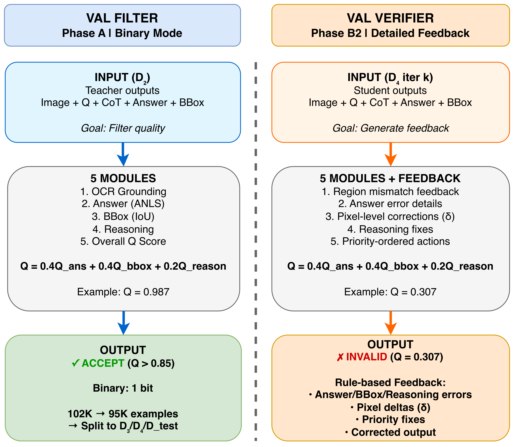

# DocVAL: Visual Answer Localization for Document VQA

Training compact Vision-Language Models to perform Document Visual Question Answering with spatial grounding using asymmetric text detection and rule-based validation feedback.

## Overview

DocVAL distills knowledge from large teacher VLMs (Gemini 2.5 Pro) into compact student models (Gemma 3-12B) that can:
- Answer questions about documents
- Localize answers with bounding boxes  
- Explain reasoning with Chain-of-Thought
- Run efficiently without OCR at inference


*DocVAL's three-phase pipeline: Teacher data generation with VAL filtering (Phase A), two-stage student training (Phase B), and pure VLM inference deployment (Phase C).*

## Quick Start

### Installation

```bash
git clone https://github.com/your-username/docval.git
cd docval
python3 -m venv envval
source envval/bin/activate
pip install -r requirements.txt
pip install -e .
```

### Setup

Create `.env` file with your API keys:

```bash
HF_TOKEN=your_huggingface_token
GEMINI_API_KEY=your_gemini_api_key
```

### Run Pipeline

```bash
# Phase A: Generate CoT data + VAL filtering
python -m docval.scripts.run_phase_a --datasets CORD DocVQA FUNSD SROIE VisualMRC
python -m docval.scripts.merge_cot_datasets
python -m docval.scripts.apply_val_filter

# Phase B: Train student model
python -m docval.training.train_b1_mac_full

# Phase C: Evaluate
python -m docval.scripts.run_phase_c_mac
```

## Project Structure

```
DocVAL/
├── README.md                 # This file
├── requirements.txt          # Dependencies
├── setup.py                  # Package setup
│
├── docs/                     # Documentation
│   ├── PHASE_A_GUIDE.md
│   ├── PHASE_B1_TRAINING_GUIDE.md
│   ├── PHASE_B2_GUIDE.md
│   ├── PHASE_C_GUIDE.md
│   └── MAC_TRAINING_GUIDE.md
│
└── docval/                   # Main package
    ├── config/              # Configuration
    ├── data/                # Data processing
    ├── models/              # Teacher/student VLMs
    ├── training/            # Training scripts
    ├── validation/          # VAL filter system
    ├── inference/           # Evaluation
    ├── scripts/             # Utility scripts
    └── utils/               # Utilities
```

## Three-Phase Pipeline

### Phase A: Teacher Data Generation
- Generate CoT examples using Gemini 2.5 Pro + DB-ResNet
- Apply VAL filter (5-module quality assessment)
- Output: 2,363 high-quality examples

### Phase B: Student Training
- **B1**: Fine-tune Gemma 3-12B on CoT data
- **B2**: Iterative refinement with VAL feedback (optional)

### Phase C: Evaluation
- Test student model on held-out set
- Pure VLM inference (no OCR)
- Compute ANLS (answer) & IoU (bbox) metrics

## Key Features

- ✅ **Asymmetric Detection**: OCR only during training
- ✅ **VAL Filter**: Rule-based quality assessment
- ✅ **Iterative Refinement**: Dynamic correction dataset
- ✅ **Mac Support**: Optimized for Apple Silicon
- ✅ **Full Fine-Tuning**: Maximum spatial reasoning



*VAL (Visual Answer Localization) Filter: 5-module quality assessment system that validates OCR grounding, answer quality (ANLS), bbox quality (IoU), reasoning quality, and computes an overall quality score.*

## Supported Models

**Teacher**: Gemini 2.5 Pro (default), GPT-5, Claude 4.5, Gemini 2.5 Flash, GPT-4o  
**Student**: Gemma 3-12B (default), Gemma 3-4B, Qwen3-VL-8B, InternVL3.5, Llama-3.2-11B  
**Detector**: DB-ResNet50 (default), CRAFT, PSENet, PaddleOCR, EasyOCR

## Hardware Requirements

**Minimum** (LoRA): RTX 3090 (24GB) or Mac M1 Pro, 32GB RAM  
**Recommended** (Full): A100 (80GB) or Mac M4 Max (64GB), 64GB RAM

## Documentation

- **[Phase A Guide](docs/PHASE_A_GUIDE.md)** - Teacher data generation
- **[Phase B1 Guide](docs/PHASE_B1_TRAINING_GUIDE.md)** - Student training
- **[Phase B2 Guide](docs/PHASE_B2_GUIDE.md)** - VAL feedback training
- **[Phase C Guide](docs/PHASE_C_GUIDE.md)** - Evaluation
- **[Mac Guide](docs/MAC_TRAINING_GUIDE.md)** - Mac-specific instructions

## Command Reference

```bash
# Phase A
python -m docval.scripts.run_phase_a --datasets CORD DocVQA FUNSD SROIE VisualMRC
python -m docval.scripts.merge_cot_datasets
python -m docval.scripts.apply_val_filter

# Phase B
python -m docval.training.train_b1_mac_full            # Full fine-tuning (Mac)
python -m docval.training.train_phase_b1 --use-lora    # LoRA (faster)
python -m docval.training.train_b2_mac                 # VAL feedback (Mac)

# Phase C
python -m docval.scripts.run_phase_c_mac

# Utilities
python -m docval.scripts.monitor_phase_a     # Monitor progress
python -m docval.scripts.show_metrics        # View metrics
python -m docval.scripts.check_progress      # Check status
```

## Results


*DocVAL achieves competitive performance on document VQA benchmarks with efficient inference. The student model (Gemma 3-12B) successfully learns spatial reasoning from teacher-generated CoT data with VAL filtering.*

## Citation

If you use DocVAL in your research, please cite:

```bibtex
@article{docval2025,
  title={DocVAL: Visual Answer Localization for Document VQA},
  author={Your Name},
  journal={arXiv preprint arXiv:XXXX.XXXXX},
  year={2025}
}
```

## License

[Your License Here]

## Contact

- GitHub: [@your-username](https://github.com/your-username)
- Paper: [arXiv link]

---

**Built for efficient document understanding**
